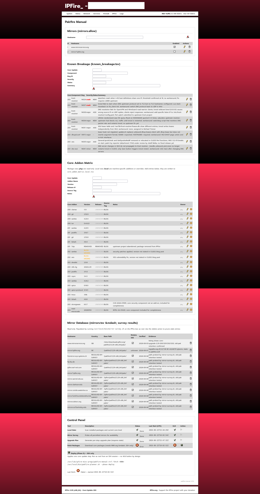

<!--
MIT License
Copyright (c) 2026 H&M
-->

# pakfire-manual - Usage Guide

Controlled sequential upgrade tool for IPFire 2.29 x86_64.
Deployed as a pakfire addon. Run all scripts on the IPFire box as root.

> **Not an official IPFire project.** Before trusting any third-party tool on your
> firewall, verify what it does. Every script in this package supports `--help` to
> show its options and `--dry-run` + `-D` (debug) to let you watch every decision
> before a single byte is written. Start there - see [Before you trust it](#before-you-trust-it).

## Before you trust it

Every script can be inspected non-destructively before you run anything for real.

**Step 1 - Read the help for each script:**

```bash
bash /usr/local/bin/pakfire-planner.sh --help
bash /usr/local/bin/mirror-survey.sh   --help
```

Each `--help` output lists every flag the script accepts. No flags, no surprises.

The pakfire deployers (`install.sh`, `update.sh`, `uninstall.sh`) are bundled
inside the `.ipfire` archive and are not installed to the system. To inspect them,
re-extract the archive in a temp directory:

```bash
mkdir /tmp/pm-inspect && cd /tmp/pm-inspect
tar -xvf /path/to/pakfire-manual-vX.Y.Z.ipfire
bash install.sh  --help
bash update.sh   --help
bash uninstall.sh --help
```

**Step 2 - Run the survey in dry-run + debug mode:**

```bash
bash /usr/local/bin/mirror-survey.sh --dry-run -D
```

This parses the IPFire mirror list and geo-checks every mirror against your egress
policy - without contacting any mirror. You see every decision printed to the
terminal AND logged to `/var/log/messages`. Nothing is written anywhere.

Example output (abbreviated - you will see one block per mirror in server-list.db):

```
[INFO] geo: loaded 230 blocked country codes from /var/ipfire/fwhosts/customlocationgrp
Parsing /opt/pakfire/db/lists/server-list.db ...

Surveying: firemirror.scp-systems.ch
[INFO] mirror: firemirror.scp-systems.ch 217.182.138.152 country=FR PERMITTED
[INFO] mirror: firemirror.scp-systems.ch: final verdict PERMITTED
[dry-run] would probe firemirror.scp-systems.ch

Surveying: ftp.yz.yamagata-u.ac.jp
[WARN] mirror: ftp.yz.yamagata-u.ac.jp 133.24.248.16 country=JP BLOCKED
[WARN] mirror: ftp.yz.yamagata-u.ac.jp: final verdict BLOCKED
SKIP (geo-blocked): ftp.yz.yamagata-u.ac.jp

Surveying: www.mirrorservice.org
[INFO] mirror: www.mirrorservice.org 212.219.56.184 country=GB PERMITTED
[INFO] mirror: www.mirrorservice.org: final verdict PERMITTED
[dry-run] would probe www.mirrorservice.org

Survey complete. Updated: /var/ipfire/pakfire-manual/mirrors.tsv
```

Read the verdict on each mirror: `PERMITTED` means the geo-check passed; `BLOCKED` means
the mirror is in a country on your egress block list. A mirror with `BLOCKED` verdict will
never be used by the planner regardless of what is in `mirrors.allow`.

**Step 3 - Run the planner in dry-run + debug mode:**

```bash
bash /usr/local/bin/pakfire-planner.sh --dry-run -D 2
```

Shows the upgrade plan for the next step (known bugs, addon matrix, mirror
verdict) without touching the system. Phase 2 is read-only by design even without
`--dry-run`; the flag adds a belt-and-suspenders guarantee for the paranoid.

Example output for a box at CU202 with CU203 pending:

```
--- Phase 2: per-step upgrade plan ---

=== Core Update 203 ===

ADD-ONS (source: blog matrix):
  dnsdist              2.0.6           [BLOG]
  ntfs-3g              2026.2.25       [BLOG]
  postfix              3.11.3          [BLOG]
  rsync                3.4.3           [BLOG]
  samba                4.24.2          [BLOG]
  spice                0.16.0          [BLOG]
  spice-protocol       0.14.5          [BLOG]
  tmux                 3.6b            [BLOG]
  tshark               4.6.6           [BLOG]
  strongswan           6.0.7           [BLOG]
  intel-microcode      20260512        [BLOG]

KNOWN BREAKAGE (source: Bugzilla):
  [crash] Bug #14024  knot-resolver NEW  assertion crash when >=16 host definitions share one IP; no workaround; fix requires LMDB upstream
  [major] Bug #13973  dhcpd.conf    -    lease hook not migrated; workaround: WUI DHCP page untick and re-tick interfaces
  [major] Bug #14035  wio           -    General::ipcidr2msk removed from general-functions.pl; Who Is Online breaks on start
  [major] Bug #14030  knot-resolver NEW  DNS replies via RED interface for VPN client requests (tun/wg); road warrior DNS resolution fails
  [major] Bug #14034  knot-resolver NEW  infinite randomised-case NS query flood on NXDOMAIN; upstream hub blocks ALL traffic until kresd restarts

  *** DEPLOY HOLD: severity=crash bug open for core 203 ***
  Phase 5 will refuse this step unless --override-hold is passed.
```

The `[crash]` severity line is the reason for the `DEPLOY HOLD`. Phase 5 will refuse
to proceed until that bug is resolved and removed from `known_breakage.tsv`. `[major]`
severity bugs are shown for awareness but do not block the deploy on their own.

**Step 4 - Watch syslog during any run:**

```bash
tail -f /var/log/messages | grep -a "pakfire-manual\|mirror-survey\|pakfire-planner"
```

Every action is logged with a structured tag (`script[subsystem]: [LEVEL] message`)
regardless of whether `-D` is set. The log is always there; `-D` just also prints it
to your terminal in real time.

Only Phase 5 (deploy) writes to disk and calls pakfire. It requires typed
confirmation of the core number before it does anything.

## Prerequisites

- IPFire 2.29 x86_64 with pakfire2 installed
- `location` (libloc) tool present (standard on IPFire)
- `curl` available
- GPG keyring with the IPFire project signing key - Phase 4 checks for the key and
  imports it automatically from the bundled `keys/` directory if it is absent;
  no manual GPG setup is required

## Installation

**Option A - if you have `fetch_add-on.sh` on the IPFire box:**

```bash
# On IPFire as root — fetches from GitHub, verifies SHA256, extracts:
bash /root/fetch_add-on.sh -c G -n horace-michael -r pakfire-manual

# Then install:
cd /opt/pakfire/tmp
NAME=pakfire-manual bash install.sh
```

**Option B - manual download:**

```bash
# On a workstation — copy the release asset to IPFire:
scp pakfire-manual-vX.Y.Z.ipfire root@<ipfire-host>:/opt/pakfire/tmp/

# On the IPFire box — extract and install:
cd /opt/pakfire/tmp
tar -xvf pakfire-manual-vX.Y.Z.ipfire
NAME=pakfire-manual bash install.sh
```

**Verify the installation:**

```bash
# Package registered:
ls /opt/pakfire/db/installed/pakfire-manual

# Scripts installed:
ls /usr/local/bin/pakfire-planner.sh /usr/local/bin/mirror-survey.sh

# Data directory with pre-seeded files:
ls /var/ipfire/pakfire-manual/

# WUI menu entry:
ls /var/ipfire/menu.d/EX-pakfire-manual.menu
```

Or open the IPFire WUI - a new **Pakfire-Manual** entry should appear in the
IPFire sidebar menu.

Installed paths:

| File | Location |
|------|----------|
| Shared library | `/usr/local/bin/pakfire-common.sh` |
| Upgrade planner | `/usr/local/bin/pakfire-planner.sh` |
| Mirror survey | `/usr/local/bin/mirror-survey.sh` |
| Data files | `/var/ipfire/pakfire-manual/` |
| WUI menu entry | `/var/ipfire/menu.d/EX-pakfire-manual.menu` |

## WUI overview

After installation, open the IPFire WUI and navigate to **IPFire → Pakfire-Manual**
in the sidebar. The page has five sections, followed by a Control Panel:

| Section | File | Purpose |
|---------|------|---------|
| **Mirrors** | `mirrors.allow` | Add/remove/enable/disable mirror hostnames. The planner uses only enabled entries and geo-checks each one at runtime. |
| **Known Breakage** | `known_breakage.tsv` | Track open Bugzilla issues per core step. The planner emits `DEPLOY HOLD` for any entry with `severity=crash`. |
| **Core Addon Matrix** | `core_addon_matrix.tsv` + `core_addon_matrix.local.tsv` | Per-core add-on version table. Package-managed base rows are read-only (lock icon); local enrichments and user additions are editable. |
| **Mirror Database** | `mirrors.tsv` | Read-only view. Populated by `mirror-survey.sh`. Shows discovered mirrors with their base path and old-pak retention. |
| **Control Panel** | - | Run buttons for Phases 1–4. Phase 5 (deploy) is SSH-only. |

The WUI is the primary interface for managing data files and launching Phases 1–4.
Phase 5 (deploy) requires an SSH session as root - there is no WUI button for it by design.



## Control Panel

The Control Panel at the bottom of the WUI page runs planner phases without an SSH
session. Each row shows a **Run** button, the current status, last start time, and last
exit code.

| Row | Phase | What it does |
|-----|-------|-------------|
| **Local State** | Phase 1 | Captures installed core level, pending add-on updates, and package inventory. Writes state to `/var/run/pakfire-manual/state.tsv`. |
| **Mirror Survey** | Phase 3 | Probes all enabled mirrors for the pakfire2 2.29 x86_64 tree. Updates Mirror Database. |
| **Upgrade Plan** | Phase 2 | Reads system state and data files; renders the step-by-step upgrade plan with known-breakage overlay. Output visible in syslog. |
| **Fetch Packages** | Phase 4 | Downloads and GPG-verifies core upgrade packages for each planned step. Requires Mirror Database to be populated. |

Status values shown in each row:

| Status | Meaning |
|--------|---------|
| Not yet run | Phase has never been triggered on this boot. Runtime state is on tmpfs; status resets on reboot. |
| Running | Background job is active. Refresh the page to poll. |
| Done | Completed with exit 0. |
| Error | Completed with non-zero exit. Check `/var/log/pakfire-manual/` for details. |

**Recommended run order:** Local State → Mirror Survey → Upgrade Plan → Fetch Packages.
Phase 2 (plan) reads Phase 1 output. Phase 4 (fetch) reads Phase 2 and Phase 3 output.
Running a later phase before an earlier one produces stale or empty results.

**Phase 5 (deploy) is not available as a WUI button.** It must be run from an SSH session
as root - see [Apply one upgrade step](#apply-one-upgrade-step) below.

---

## Data files and how they interact

`mirrors.allow` and `mirrors.tsv` work together - both are required for the planner
to reach a mirror:

- **`mirrors.allow`** - the *whitelist*: hostnames the planner is permitted to use.
  Pre-seeded with `www.mirrorservice.org`. Manage via the WUI Mirrors section.
  The planner geo-checks every enabled entry at runtime against your egress policy.

- **`mirrors.tsv`** - the *path database*: tells the planner WHERE on each mirror
  server the pakfire2 tree lives. Starts **empty** after first install. Must be
  populated by `mirror-survey.sh` before the planner can download anything.

Workflow: after first install, run `mirror-survey.sh` once → it discovers mirror
paths and writes them to `mirrors.tsv` → the planner can then resolve a usable
mirror for every geo-permitted entry in `mirrors.allow`.

## CLI flags (all scripts)

Every script supports these flags:

| Flag | Short | Effect |
|------|-------|--------|
| `--help` | `-h` | Print all flags and exit - start here |
| `--debug` | `-D` | Print every action to stdout in real time (always logged to syslog regardless) |
| `--version` | `-v` | Print script name and version, then exit |
| `--dry-run` | - | Parse/plan only; no writes, no pakfire calls (planner and mirror-survey only) |

`-D` and `--dry-run` are safe to combine. The script will show you every decision it
would make without executing any of them.

Examples:

```bash
# Discover all flags for any script:
bash /usr/local/bin/pakfire-planner.sh -h
bash /usr/local/bin/mirror-survey.sh   -h

# See exactly what the survey does — no probing, full decision trace:
bash /usr/local/bin/mirror-survey.sh --dry-run -D

# See the upgrade plan with full decision trace:
bash /usr/local/bin/pakfire-planner.sh --dry-run -D 2

# Run silently (syslog only — check /var/log/messages after):
bash /usr/local/bin/mirror-survey.sh
```

## Dual logging

All scripts log to two destinations simultaneously:

- **Syslog** (`/var/log/messages`) - always active, tag format `scriptname[subsystem]`.
  Use `grep -a "pakfire-manual\|mirror-survey\|pakfire-planner" /var/log/messages` to review.
- **Stdout** - only when `--debug` / `-D` is passed, or `DEBUG=true` is exported.

Log format in syslog:

```
Aug  8 11:11:17 <ipfire-test> mirror-survey[mirror]: [WARN] ftp.belnet.be 193.190.198.27 country=UNKNOWN: treat as SKIP
Aug  8 11:11:17 <ipfire-test> mirror-survey[geo]:    [INFO] loaded 230 blocked country codes from /var/ipfire/fwhosts/customlocationgrp
Aug  8 11:01:50 <ipfire-test> pakfire-manual[update]: Extracting new payload
```

> **Note:** Always use `grep -a` when reading `/var/log/messages` directly to avoid
> binary-file false negatives from multi-byte characters written by other services.
> Example: `grep -a "mirror-survey" /var/log/messages`

Monitor in real time during a run:

```bash
tail -f /var/log/messages | grep -a "pakfire-manual\|mirror-survey\|pakfire-planner"
```

## Configuration

### mirrors.allow

`/var/ipfire/pakfire-manual/mirrors.allow` - mirror hostnames permitted for
pakfire fetches. One hostname per line; `#` lines are comments.

The toolkit geo-checks each hostname at runtime against
`/var/ipfire/fwhosts/customlocationgrp`. Do not add/remove entries based on
country codes - the runtime check enforces the egress policy automatically.

`www.mirrorservice.org` (GB) is the only confirmed working mirror for the full
pakfire2 2.29-x86_64 tree (verified 2026-08-03). If it becomes blocked by
your egress policy, comment it out and run `mirror-survey.sh` to discover others.

### mirrors.tsv

`/var/ipfire/pakfire-manual/mirrors.tsv` - survey database populated by
`mirror-survey.sh`. **Starts empty after first install.** Run `mirror-survey.sh`
once to populate it. The planner reads `base_path` from here to know where to
download core paks. Do not edit manually; use the survey script to populate it.

### known_breakage.tsv

`/var/ipfire/pakfire-manual/known_breakage.tsv` - open Bugzilla entries with
per-step severity ratings. Update this file when bugs are closed or new ones
are discovered. The planner reads it to emit `DEPLOY HOLD` warnings.

### core_addon_matrix.tsv

`/var/ipfire/pakfire-manual/core_addon_matrix.tsv` - add-on version table
sourced from IPFire blog posts (authoritative). Refresh from the blog when
new core updates are released.

## Workflow

### One-time setup after first install

```bash
# 1. Survey all mirrors — discover paths and probe geo-policy:
bash /usr/local/bin/mirror-survey.sh

# 2. Confirm mirrors.tsv was populated (also visible in WUI → Mirror Database):
grep -c '' /var/ipfire/pakfire-manual/mirrors.tsv

# 3. Download all intermediate core paks in advance (safe to run at any time):
bash /usr/local/bin/pakfire-planner.sh 4
```

To test the survey without probing mirrors:

```bash
bash /usr/local/bin/mirror-survey.sh --dry-run --debug
```

### Before each upgrade step

```bash
# Capture current system state:
bash /usr/local/bin/pakfire-planner.sh 1
```

Example Phase 1 output:

```
--- Phase 1: local state ---
Installed core: 202

State written to /var/run/pakfire-manual/state.tsv
Available core: 203
Upgrade steps required: 203

Pending add-on changes:
  guardian             27 -> 28
  htop                 23 -> 25
  iperf3               8 -> 9
```

Phase 1 reads the current core from pakfire's database, queries the available update,
and lists add-ons that have a pending release change. It writes this to a run-state
file that Phase 2 reads - always run Phase 1 first.

```bash
# Review the plan for the next step:
bash /usr/local/bin/pakfire-planner.sh 2
```

Example Phase 2 output (CU202 → CU203, with a crash bug blocking deploy):

```
--- Phase 2: per-step upgrade plan ---

=== Core Update 203 ===

ADD-ONS (source: blog matrix):
  dnsdist              2.0.6           [BLOG]
  ntfs-3g              2026.2.25       [BLOG]
  postfix              3.11.3          [BLOG]
  rsync                3.4.3           [BLOG]
  samba                4.24.2          [BLOG]
  spice                0.16.0          [BLOG]
  spice-protocol       0.14.5          [BLOG]
  tmux                 3.6b            [BLOG]
  tshark               4.6.6           [BLOG]
  strongswan           6.0.7           [BLOG]
  intel-microcode      20260512        [BLOG]

KNOWN BREAKAGE (source: Bugzilla):
  [crash] Bug #14024  knot-resolver NEW  assertion crash when >=16 host definitions share one IP; no workaround; fix requires LMDB upstream
  [major] Bug #13973  dhcpd.conf    -    lease hook not migrated; workaround: WUI DHCP page untick and re-tick interfaces
  [major] Bug #14035  wio           -    General::ipcidr2msk removed from general-functions.pl; Who Is Online breaks on start
  [major] Bug #14030  knot-resolver NEW  DNS replies via RED interface for VPN client requests (tun/wg); road warrior DNS resolution fails
  [major] Bug #14034  knot-resolver NEW  infinite randomised-case NS query flood on NXDOMAIN; upstream hub blocks ALL traffic until kresd restarts

  *** DEPLOY HOLD: severity=crash bug open for core 203 ***
  Phase 5 will refuse this step unless --override-hold is passed.
```

Review Phase 2 output carefully:
- `DEPLOY HOLD` - a crash-severity bug is open; do not proceed until the bug
  is closed and `known_breakage.tsv` is updated
- `MATRIX-GAP` - no addon data for that step; refresh `core_addon_matrix.tsv`
  from the IPFire blog before proceeding
- `NO USABLE MIRROR` - `mirrors.tsv` is empty or no permitted mirror has a path
  entry; run `mirror-survey.sh` first

### Apply one upgrade step

```bash
bash /usr/local/bin/pakfire-planner.sh 5
```

Phase 5 applies exactly one core step (current+1). Apply steps sequentially:
200 → 201 → 202 → 203. Never skip a step.

**If a crash-severity bug is open**, Phase 5 refuses immediately and exits - no
confirmation prompt is shown:

```
--- Phase 5: guarded deploy ---
Current core: 202   Next step: 203

*** DEPLOY HOLD for core 203 ***
  Bug #14024  assertion crash when >=16 host definitions share one IP; threshold confirmed at 16; no workaround; fix requires LMDB upstream

Refused. Pass --override-hold to bypass (requires typed confirmation).
```

This is the expected behaviour when a `[crash]` bug is in `known_breakage.tsv` for
the target core. Remove or mark the bug resolved in `known_breakage.tsv` (via the
WUI Known Breakage section) once it is fixed upstream, then re-run Phase 5.

After Phase 5 exits successfully:
1. Review the error and warning logs it printed
2. Reboot manually (`reboot` or WUI)
3. Verify the post-reboot checklist (see HANDOFF.md written by Phase 6)

```bash
# After rebooting — write the handoff document:
bash /usr/local/bin/pakfire-planner.sh 6
```

## Safeguard folder

If you pre-downloaded intermediate core paks, GPG-verify the entire folder
before using any file from it:

```bash
source /usr/local/bin/pakfire-common.sh
verify_existing_archive /path/to/your/safeguard/folder
```

GPG signature files (`.gpg`) must be present alongside each `.ipfire` pak.

## Emergency rollback

If a deploy goes wrong before reboot: the pre-update snapshot is at
`/var/log/pakfire-manual/snap-before-core<N>-<timestamp>/`. Restore config
files from there.

IPFire does not support rolling back a core update after reboot. The safeguard
folder provides packages for a clean reinstall if required.

## Updating the package

**Option A - fetch_add-on.sh (recommended):**

```bash
# On IPFire as root — fetches new version from GitHub, verifies SHA256, extracts:
bash /root/fetch_add-on.sh -c G -n horace-michael -r pakfire-manual

# Then update (preserves all data files):
cd /opt/pakfire/tmp
NAME=pakfire-manual bash update.sh --debug
```

**Option B - manual:**

```bash
# On a workstation — copy the new release asset to IPFire:
scp pakfire-manual-vX.Y.Z.ipfire root@<ipfire-host>:/opt/pakfire/tmp/

# On the IPFire box:
cd /opt/pakfire/tmp
tar -xvf pakfire-manual-vX.Y.Z.ipfire        # must extract before running update.sh
NAME=pakfire-manual bash update.sh --debug   # --debug to confirm each step
```

Persistent data files (`mirrors.allow`, `mirrors.tsv`, `known_breakage.tsv`,
`core_addon_matrix.tsv`) are backed up before extraction and restored after,
so no configuration is lost on update.

## Removing the package

```bash
# Re-extract the .ipfire archive first if you no longer have the extracted files:
cd /opt/pakfire/tmp
tar -xvf pakfire-manual-vX.Y.Z.ipfire

NAME=pakfire-manual bash uninstall.sh
```

This removes all installed files and data directories. Backup your data files
first if you want to preserve them:

```bash
cp -r /var/ipfire/pakfire-manual/ ~/pakfire-manual-data-backup/
```
